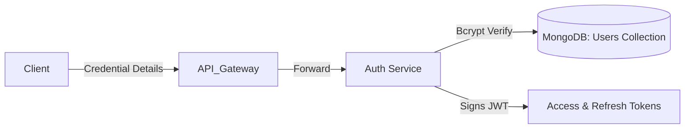

# Authentication Service (auth-service)

The Auth Service manages user registration, session authentication, password hashing, and JSON Web Token (JWT) issuance. Built with **FastAPI** and using **MongoDB** (via the asynchronous **Motor** driver) as its database, it provides the secure foundation for authentication across the entire ArchGen platform.

---

## 1. Architecture & Security Context

The service defines authentication models and business logic in [routes/auth.py](file:///c:/Users/Praveen/Desktop/New%20folder/auth-service/routes/auth.py) and utilizes helpers in [utils/auth_helper.py](file:///c:/Users/Praveen/Desktop/New%20folder/auth-service/utils/auth_helper.py).



### Hashing & Security Policies:
1. **Password Hashing**: Passwords are never stored in plain text. The service uses **bcrypt** (`hashpw` with adaptive work factor salt rounds) to generate cryptographic hashes.
2. **Access Tokens**: Short-lived JWTs (typically 15-30 minutes) signed using `HS256`. It contains claims such as:
   - `sub`: The username.
   - `exp`: Token expiration timestamp.
   - `type`: Set to `"access"`.
3. **Refresh Tokens**: Long-lived JWTs (typically 7-30 days) used to retrieve a new access token without requiring password re-entry. It contains claims:
   - `sub`: The username.
   - `exp`: Token expiration timestamp.
   - `type`: Set to `"refresh"`.
4. **Secrets Configuration**: Key Vault values mapped into the environment variable `JWT_SECRET_KEY` are used to verify and sign tokens.

---

## 2. Configuration & Environment Variables

The configuration settings are loaded via standard environment bindings in [main.py](file:///c:/Users/Praveen/Desktop/New%20folder/auth-service/main.py):

| Variable | Type | Default | Description |
|---|---|---|---|
| `MONGO_URI` | `str` | *Required* | Connection string to MongoDB (e.g. `mongodb://host:port/database` or Azure Cosmos DB API for MongoDB). |
| `DATABASE_NAME` | `str` | `archgen_db` | Target MongoDB database name. |
| `JWT_SECRET_KEY` | `str` | *Required* | Secret key for signing and verifying JWT signatures. |
| `ACCESS_TOKEN_EXPIRE_MINUTES` | `int` | `30` | Access token lifetime duration. |
| `REFRESH_TOKEN_EXPIRE_DAYS` | `int` | `7` | Refresh token lifetime duration. |
| `ALLOWED_ORIGINS` | `str` | `http://localhost:3000` | CORS allowed origins. |

---

## 3. Database Schema

Users are stored in the `users` collection. A standard document layout:

```json
{
  "_id": {"$oid": "65c829e06180a312456e7aa2"},
  "username": "johndoe",
  "password": "$2b$12$R9h/cIPzVE8KC6v.xWyg.O...",
  "email": "johndoe@example.com"
}
```

---

## 4. API Reference

All routes are prefixed with `/auth`. Authentication endpoints expect standard JSON content payloads.

### Health Check

#### `GET /healthz`
- **Description**: Returns basic health status.
- **Response (200 OK)**:
  ```json
  {
    "status": "healthy"
  }
  ```

#### `GET /ready` or `GET /readyz`
- **Description**: Returns readiness probe status.
- **Response (200 OK)**:
  ```json
  {
    "status": "ready"
  }
  ```

### User Registration

#### `POST /auth/register`
- **Description**: Creates a new user profile inside MongoDB.
- **Request Body (`UserRegisterInput`)**:
  ```json
  {
    "username": "johndoe",
    "password": "strongPassword123",
    "email": "johndoe@example.com"
  }
  ```
  - `username`: String (length 3 to 50).
  - `password`: String (minimum length 6).
  - `email`: String (must conform to standard email regex).
- **Responses**:
  - **200 OK**: Registration successful.
    ```json
    {
      "status": "success",
      "message": "Registration completed successfully."
    }
    ```
  - **400 Bad Request**: Username or email address is already in use.
    ```json
    {
      "detail": "Username is already registered."
    }
    ```

### User Login

#### `POST /auth/login`
- **Description**: Authenticates user credentials. Generates and returns JWT tokens and the user profile.
- **Request Body (`UserLoginInput`)**:
  ```json
  {
    "username": "johndoe",
    "password": "strongPassword123"
  }
  ```
- **Responses**:
  - **200 OK**: Access and refresh tokens generated.
    ```json
    {
      "access_token": "eyJhbGciOiJIUzI1NiIsInR5cCI6IkpXVCJ9...",
      "refresh_token": "eyJhbGciOiJIUzI1NiIsInR5cCI6IkpXVCJ9...",
      "user": {
        "username": "johndoe",
        "email": "johndoe@example.com"
      }
    }
    ```
  - **401 Unauthorized**: Invalid credentials.
    ```json
    {
      "detail": "Invalid username or password."
    }
    ```

### Token Refresh

#### `POST /auth/refresh`
- **Description**: Issues a new short-lived access token using a valid, unexpired refresh token.
- **Request Body (`TokenRefreshInput`)**:
  ```json
  {
    "refresh_token": "eyJhbGciOiJIUzI1NiIsInR5cCI6IkpXVCJ9..."
  }
  ```
- **Responses**:
  - **200 OK**: New access token returned.
    ```json
    {
      "access_token": "eyJhbGciOiJIUzI1NiIsInR5cCI6IkpXVCJ9..."
    }
    ```
  - **401 Unauthorized**: Refresh token is malformed, expired, or invalid.
    ```json
    {
      "detail": "Refresh token signature invalid or expired."
    }
    ```

### Get User Profile

#### `GET /auth/me`
- **Description**: Returns profile details for the currently authenticated user.
- **Request Headers**:
  - `Authorization: Bearer <access_token>` (Required)
- **Responses**:
  - **200 OK**: Valid session. Returns user record details.
    ```json
    {
      "id": "65c829e06180a312456e7aa2",
      "username": "johndoe",
      "email": "johndoe@example.com"
    }
    ```
  - **401 Unauthorized**: Missing or expired access token.
    ```json
    {
      "detail": "Token signature expired or malformed"
    }
    ```

---

## 5. OpenAPI & Interactive API Documentation

FastAPI automatically compiles schema rules and hosts interactive documentation panels:
- **Swagger UI**: Access at `http://localhost:8001/docs` in local dev environments.
- **ReDoc**: Access at `http://localhost:8001/redoc` in local dev environments.
- These endpoints provide interactive testing tools for developers to invoke login/register APIs directly from the browser.
